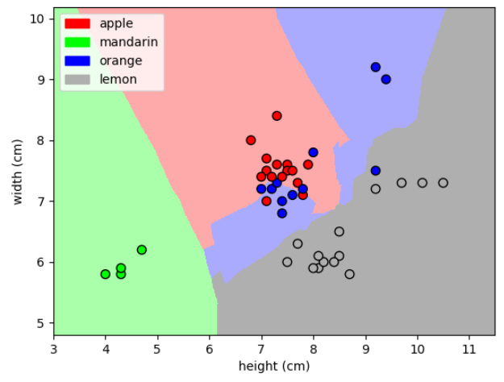
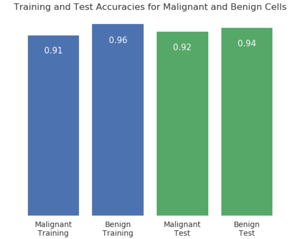
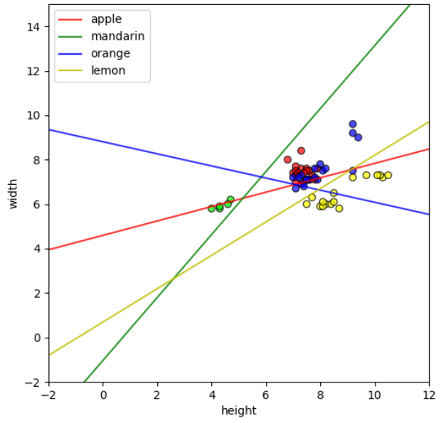
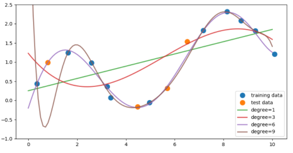

# coursera_3_applied_machine_learning
My work from Coursera's Applied Machine Learning in Python course, the second course in the data science specialization through UM. The course is hosted here: <https://www.coursera.org/learn/python-machine-learning/home/welcome>

# Author info
Patricia Schuster  
June 2018  
University of Michigan  

# Week 1: Introduction to `scikit-learn` 

* [Notes](week_1/week_1_notes.ipynb)
    * Key concepts in machine learning/home/welcome
    * Object recognition
    * Training, testing sets
    * k-nearest neighbors algorithm, code it from scratch and with scikit-learn
    * k-NN example with fruit classification

    
* [Assignment 1](week_1/Assignment_1.ipynb)
    * Analyze the Breast Cancer Wisconsin Database  
    * Import to pandas DataFrame  
    * Implement train-test split and train k-NN classifier  
    * Predict class label, calculate train and test accuracies  
    

# Week 2: Introduction to supervised machine learning  

* [Notes](week_2/week_2_notes.ipynb)
    * Overview of supervised learning methods  
    * Generalization, overfitting, underfitting  
    * Regression: Ridge, lasso, logistic, linear 
    * Polynomial feature transformation  
    * Linear classifiers, Support Vector Machines  
    * Multi-class classification example with `LinearSVC`:
    

* [Assignment 2](week_2/Assignment_2.ipynb)  
    * Predict the degree of polynomial fit  
    * Determine degree levels that correspond to underfitting, overfitting  
    * Calculate $R^2$ for linear and lasso regression  
    * Perform classification on mushroom species  
    

# Week 3: Model evaluation and selection  

* [Notes](week_3/week_3.ipynb)  
    * Accuracy  
    * Using a dummy classifier  
    * Binary prediction outcomes, confusion matrix  
    * Decision function  
* [Assignment 3](week_3/Assignment+3.ipynb)  
    * Train several models to predict instances of fraud in credit card transactions  
    * Calculate accuracy using a dummy classifier, an SVC classifier, and logistic regression  
    * Generate a precision curve and a ROC curve  
    
# Week 4: Supervised machine learning part two

* [Notes](week_4/week_4_notes.ipynb)  
    * Naive Bayes classifiers  
    * Random forests  
    * Gradient-boosted decision trees  
    * Neural networks  
* Assignment 4  
    * [Explore the data](week_4/Assignment+4+explore.ipynb)    
    * [Solution here](week_4/Assignment+4+solution.ipynb)  
    * Predict property maintenance fines for the city of Detroit  
    * Clean up the data and implement random forest classifier  
    * Return predictions, which are scored with area under ROC curve (AUC)  